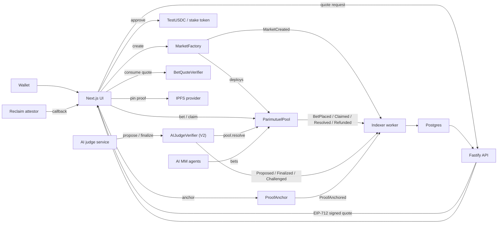

# Adjudex Architecture

Adjudex is an AI-native prediction-market product on Arbitrum Sepolia (and
optionally Robinhood Chain). It composes a parimutuel pool primitive with
an **optimistic** AI-judge resolver, on-chain Reclaim proof anchoring,
EIP-712 signed bet quotes, a hardened Postgres indexer, and an
agent-as-LP layer registered through an ERC-8004-style oracle.

The single product rule: user-facing markets, balances, positions,
activity, timelines, settings, watchlists, notifications, and resolution
state must come from **contracts, the indexer, Postgres/API,
SIWE-authenticated backend persistence, or confirmed chain reads**. The
UI may show loading, empty, or setup states — it never invents records.

## 1. Product flow

```text
Discover -> Trust -> Connect -> Act -> Track -> Resolve -> Share
```

| Stage    | What backs it |
|---|---|
| Discover | indexed `MarketCreated` events + imported source-backed candidates |
| Trust    | every market exposes contract, pool, source URL, resolution rules, creation tx, activity, proof links |
| Connect  | wallet/network status surfaces Arbitrum Sepolia + RHC readiness separately |
| Act      | create, bet, propose, challenge, finalize, claim — every action a confirmed tx |
| Track    | portfolio, activity, agent moves, market timeline — all API/indexer-backed |
| Resolve  | optimistic propose → 2h challenge window → finalize, all on `AIJudgeVerifier` |
| Share    | market/result proof links point back to indexed market pages and explorers |

## 2. Smart-contract surface

### 2.1 ParimutuelPool

Each market is a self-contained `ParimutuelPool` holding `yesPool` and
`noPool` stake-token balances. Winners split the entire pool pro-rata to
their stake on the winning side.

```text
payout(myStake, mySide) =
  mySide == resolvedSide
    ? myStake * (yesPool + noPool) / winningPool
    : 0
```

Solvency invariant: `sum(claims) <= yesPool + noPool`. Integer division
floors rounding dust into the pool. No AMM impermanent loss — AI
market-maker agents are bettors / liquidity participants, not privileged
resolvers.

`refundAfterGrace()` kicks in 14 days past `deadline` if no resolution
occurred, so capital never gets locked by a vanished resolver.

### 2.2 MarketFactory

Deploys `ParimutuelPool` per market, optionally with an embedded spec URI
(base64 data URI or external link). Emits `MarketCreated(marketId, pool,
specHash, creator, ...)` consumed by the indexer.

### 2.3 AIJudgeVerifier (V2 optimistic)

Replaces the legacy single-shot `verifyAndResolve` with an optimistic
state machine:

```text
None  ── propose ──►  Pending  ── (window elapses) ── finalize ──►  Finalized
                          │
                          └── challenge ──►  Disputed  ── overrideAndFinalize (owner) ──►  Finalized
```

Storage (per `marketId`):
- `pool` (address)
- `outcome` (uint8)
- `evidenceHash` (bytes32 — keccak of reasoning bytes, optionally
  XOR-folded with the Reclaim `proofHash`)
- `proposedAt` (uint64)
- `status` (enum None | Pending | Disputed | Finalized)
- `challenger` (address)

Public reads: `proposals(marketId)`, `canFinalize(marketId)`,
`challengeDeadline(marketId)`.

Constants: `CHALLENGE_WINDOW = 2 hours`.

Backwards compatibility: `verifyAndResolve(...)` is retained but reverts
unless `block.timestamp <= fastTrackUntil`. Default `fastTrackUntil = 0`
disables it. Operators raise it only for fast testnet checks.

### 2.4 ProofAnchor

Public, permissionless registry that anchors Reclaim zkTLS proofs by
sessionId. `anchor(sessionId, proofHash, cid)` records the proof hash and
its IPFS CID on chain and emits
`ProofAnchored(sessionIdHash, proofHash, publisher, cid, anchoredAt)`.

One anchor per sessionId — first publisher binds. Anyone can read via
`getAnchor(sessionId)` / `getAnchorByKey(sessionIdHash)` /
`isAnchored(sessionId)`.

### 2.5 BetQuoteVerifier

EIP-712 domain: `name = "Adjudex Bet Quote", version = "1",
chainId = block.chainid, verifyingContract = address(this)`.

`BetQuote` struct:
```
address pool
uint256 marketId
uint8   side          // 0 = YES, 1 = NO
uint256 stake         // base units (6 dec USDC)
uint256 minShares     // slippage floor
uint256 maxPoolImpactBps
uint256 deadline      // unix seconds
uint256 nonce
address bettor
```

`consume(quote, sig)` enforces signature (against `quoteSigner`),
deadline, `msg.sender == bettor`, and nonce uniqueness. Emits
`QuoteConsumed(bettor, nonce, quoteHash)`. Used today as a standalone
verifier; the next pool upgrade adds `betWithQuote(quote, sig)` that
calls `consume()` before executing the bet.

### 2.6 ReputationOracle

ERC-8004-style permissionless agent registry. AI market-makers register
their handle and update reputation through hooks emitted by
`AIJudgeVerifier` and `ParimutuelPool` lifecycle events.

### 2.7 PriceOracle + TokenizedStockAdapter

Operator-set + Chainlink fallback price oracle (8 decimals normalised).
The adapter wires tokenized-equity symbols to the underlying
Chainlink-compatible feeds.

### 2.8 Stylus port

`contracts/stylus/ai-judge-verifier/src/lib.rs` mirrors the V2 Solidity
ABI in pure Rust:
- `k256` ECDSA recovery (Stylus contracts cannot use Solidity's
  `ecrecover` precompile)
- `sha3` Keccak256
- Same storage layout (judge, owner, fastTrackUntil, proposals mapping)
- Same digest format and EIP-191 prefix

Build from WSL2: `cd contracts/stylus/ai-judge-verifier && cargo stylus
check`. Deploys to the same ABI surface as the Solidity version so the
off-chain signer code does not change.

## 3. AI roles

Adjudex keeps AI liquidity and AI resolution strictly separated.

- **AI Market-Maker** (`services/mm-agent/`) — registers in
  `ReputationOracle`, watches open pools, places counter-bets when the
  pool is imbalanced. All actions are wallet transactions visible
  through the indexer.
- **AI Resolver** (`services/ai-judge/`) — produces a soft-market
  verdict, optionally inside a Phala TEE, signs the digest with
  `JUDGE_PRIVATE_KEY`, and posts `propose()` to `AIJudgeVerifier`. The
  zkTLS proof hash is folded into `evidenceHash`.

AI output is never source of truth alone. It must be bound to
evidenceHash + (optional) Reclaim proof and executed via the
optimistic-resolution path. Even an honest verdict gets a 2h window to
be challenged.

## 4. Data flow



### 4.1 Stage 3 scale path

The API now supports shared infrastructure modes for scaled deployments:

- `RATE_LIMIT_BACKEND=memory` keeps per-process buckets for local or single-instance deployments.
- `RATE_LIMIT_BACKEND=redis` uses `REDIS_REST_URL` and `REDIS_REST_TOKEN` so multiple Fastify instances share rate-limit buckets.
- `MARKETS_CACHE_BACKEND=redis` enables short read-through cache for `GET /api/markets`.

The cache is intentionally narrow. It stores only market-list API responses for a short TTL and never stores wallet-scoped portfolio, settings, watchlist, notifications, balances, or transaction state. If Redis is unavailable, the route falls back to Postgres and logs the cache failure.

### 4.2 Stage 3 retention path

Retention analytics are also backend-sourced:

- `user_activity_events` records wallet-scoped product events after SIWE sign-in or confirmed server-side actions.
- `POST /api/analytics/events` accepts only allowlisted authenticated client events such as portfolio views or saved searches.
- `GET /api/analytics/retention` is admin-only and returns D1, D7, and D30 cohorts from Postgres.
- Bet and claim events are recorded only after the backend verifies the confirmed transaction/indexed row.

No retention metric is computed from browser storage or generated client state.

### 4.3 Stage 3 mobile PWA path

The mobile shell is installable without changing the data model:

- `src/app/manifest.ts` defines the installable app manifest and shortcuts.
- `src/app/icon.tsx` and `src/app/apple-icon.tsx` generate mobile icons.
- `src/components/app/PwaServiceWorker.tsx` registers `public/sw.js` in production.
- `public/sw.js` caches only static shell assets and `/offline`.
- `/api/*` requests are network-only, so market, portfolio, balance,
  transaction, settings, notification, and retention data are never served from
  the service-worker cache.
- `/offline` explains that live product data requires backend, indexer, and RPC
  availability.

### 4.4 Stage 3 liquidity incentive path

Liquidity incentives are configured and reconciled by the backend:

- `liquidity_incentive_programs` stores admin-created program windows, top
  percentile cutoff, rebate bps, minimum volume, and optional budget.
- `GET /api/liquidity/incentives` computes eligibility from indexed
  `positions` only.
- `liquidity_incentive_payouts` stores recorded payout transactions after
  transaction sync verifies the submitted hash and chain.
- The UI at `/liquidity` shows no synthetic participants when the backend has
  no active program or no indexed positions.

### 4.5 Stage 3 agent ecosystem path

Agent ecosystem surfaces are backend/indexer-backed:

- `GET /api/agents/ecosystem` reads `agents`, `activity_events`, and
  `agent_reputation_history` derived metrics. It returns an empty status when
  no registry rows exist.
- `POST /api/agents/register` verifies the submitted tx hash on the requested
  chain and records an agent only when the receipt contains `AgentRegistered`
  from the configured `ReputationOracle`.
- `agents.registration_tx_hash`, `agents.chain_id`, and `agents.registered_at`
  bind the profile to an on-chain registration event.
- The UI at `/agents` shows registry readiness, top agents, recent moves, and
  a confirmed-registration form without adding client-only agent rows.

### 4.6 Read model

- **Market list / detail** → `markets`, `market_stats`,
  `market_timeline`, `activity_events`
- **Portfolio** → `positions`, `claims`, `refunds`, final pool stats,
  confirmed tx identity
- **Watchlist / settings / notifications** → SIWE session + backend
  tables (rate-limit + admin allowlist applied)
- **Retention analytics** → `user_activity_events` with admin-gated
  cohort API.
- **Liquidity incentives** → `liquidity_incentive_programs`,
  `positions`, and `liquidity_incentive_payouts`.
- **Agents** → `agents`, `agent_reputation_history`, indexed activity,
  proof URLs
- **Resolution** → `markets` resolution fields + verifier and pool events
  (`Proposed`, `Challenged`, `Finalized`, `Resolved`)
- **Proof** → `ProofAnchored` events keyed by `keccak(sessionId)`

### 4.7 Write model

| Action | Path | Verification |
|---|---|---|
| Create market | wallet → `MarketFactory.createMarket{,WithSpec,Soft}` | receipt + `MarketCreated` event |
| Bet | (optional) `/api/bets/quote` → wallet → `ParimutuelPool.bet` | backend `previewBet` + indexed `BetPlaced` |
| Propose | judge service → `AIJudgeVerifier.propose` | signature recover == `judge` |
| Challenge | anyone → `AIJudgeVerifier.challenge` | within `CHALLENGE_WINDOW` |
| Finalize | anyone → `AIJudgeVerifier.finalize` | after window, status == Pending |
| Override | owner → `AIJudgeVerifier.overrideAndFinalize` | status == Disputed |
| Claim | wallet → `ParimutuelPool.claim` | indexed `Claimed` |
| Anchor proof | proof anchor wallet → `ProofAnchor.anchor` | indexed `ProofAnchored` |
| Importer deploy | admin (SIWE + allowlist) → factory | validated candidate + `MarketCreated` |
| Register agent | agent wallet → `ReputationOracle.registerAgent` | receipt + trusted `AgentRegistered` |
| Settings / watchlist / notifications | SIWE | backend tables |
| Retention event | SIWE or confirmed backend action | allowlisted event kind or verified tx/indexed row |
| Liquidity program | SIWE admin | backend program table |
| Liquidity payout | SIWE admin | synced transaction hash + payout table |

## 5. Indexer model

`services/indexer/src/index.ts` runs `syncOnce()` on
`INDEXER_INTERVAL_MS`:

1. Read head, compute `safeHead = head - INDEXER_CONFIRMATIONS`. Only
   confirmed blocks are indexed.
2. Reorg probe: re-fetch block at the cursor's `last_block`. If the hash
   diverged from `last_block_hash`, mark `last_status='reorg'`,
   `last_reorg_at = now()`, rewind by `2 * confirmations`, and continue.
3. For each market: sync market state (pool reads) + events in
   `[fromBlock, toBlock]`.
4. Capture new tip hash → write `indexer_state(last_block,
   last_block_hash, last_status, last_error, last_reorg_at,
   updated_at)`.

Errors caught in `syncOnce` are persisted as `last_status='error'`,
`last_error=<message>` so `/api/status` surfaces them.

### 5.1 Tables touched

| Table | Owner |
|---|---|
| `markets`, `market_stats`, `market_timeline` | indexer |
| `positions`, `claims`, `refunds` | indexer |
| `activity_events` | indexer |
| `notification_events` | indexer (creates payout/watchlist notifications) |
| `user_activity_events` | API (retention events and cohorts) |
| `liquidity_incentive_programs`, `liquidity_incentive_payouts` | API (liquidity programs and recorded payouts) |
| `agents`, `agent_reputation_history` | indexer + reputation events |
| `indexer_state` | indexer (own cursor / status / reorg meta) |
| `import_sources`, `import_candidates`, `import_deployments` | API (admin) |
| `auth_sessions`, `user_settings`, `watchlist` | API (SIWE) |
| `reclaim_proofs` | API (Next callback writes through `RECLAIM_PROOF_WRITE_SECRET`) |

### 5.2 Backfill / replay

```bash
pnpm indexer:backfill <fromBlock> <toBlock>
```

Re-emits events into the schema with `ON CONFLICT DO NOTHING/UPDATE`
without touching the live cursor. Use after a known reorg or when wiring
a new chain.

### 5.3 Health surface

`GET /api/status` exposes per-chain:
- `indexer.lastBlock`, `lastBlockHash`
- `indexer.lastStatus` (`ok` | `reorg` | `error`)
- `indexer.lastError`, `lastReorgAtIso`, `reorgRecent` (< 1h)
- `indexer.lagBlocks`, `stale`, `ageSeconds`
- `STATUS_INDEXER_STALE_MS`, `STATUS_INDEXER_LAG_BLOCKS` thresholds

## 6. Backend API

`services/api/` is a Fastify app. Top-level concerns:

- **CORS** open in dev, restrict by origin in production.
- **Rate limiter** — global `onRequest` hook (`rate-limit.ts`). 30 writes
  / 240 reads per minute per IP. `/health`, `/api/status` are unmetered.
- **SIWE** — `auth.ts` builds the SIWE message, verifies signature,
  issues `adjudex_session` HttpOnly cookie with 7d TTL.
- **Admin allowlist** — `parseAdminAllowlist()` reads
  `IMPORT_ADMIN_ADDRESSES` (or legacy `ADMIN_WALLET_ADDRESSES`).
  Importer routes call `requireImportAdmin()` (401 / 403 / 503).
- **EIP-712 quote signer** — `/api/bets/quote` issues signed `BetQuote`
  payloads bound to `BET_QUOTE_VERIFIER_ADDRESS`.
- **Transaction recovery** — `/api/sync/transaction` verifies receipt,
  chain id, optional confirmation depth, decodes known events.

### 6.1 Public routes (read)

- `GET /api/markets`, `:id`, `:id/activity`, `:id/timeline`
- `GET /api/portfolio/:address/positions`, `/history`
- `GET /api/agents`, `/ecosystem`, `:id`, `:id/moves`, `:id/reputation`
- `POST /api/agents/register`
- `GET /api/leaderboard`
- `GET /api/notifications`
- `GET /api/import/sources`
- `GET /api/liquidity/incentives`

### 6.2 Authenticated routes (SIWE)

- `GET/PUT /api/settings`
- `GET/POST /api/watchlist`, `DELETE /api/watchlist/:marketId`
- `POST /api/notifications/read`, `PATCH /api/notifications/:id/read`
- `POST /api/analytics/events`
- `GET /api/analytics/retention` (additionally requires admin allowlist)
- `POST /api/liquidity/programs`, `POST /api/liquidity/payouts`
  (additionally require admin allowlist)
- `POST /api/import/scan`, `GET /api/import/candidates`,
  `POST /api/import/candidates/:id/validate`, `:id/deploy`
  (additionally require `requireImportAdmin`)

### 6.3 Write / sync routes

- `POST /api/auth/nonce`, `/verify`
- `POST /api/sync/transaction`
- `POST /api/markets/validate`, `/generate`, `/api/markets`
- `POST /api/bets/preview`, `/quote`, `/api/bets`
- `POST /api/claim`
- `POST /api/reclaim/session`, `GET /api/reclaim/get`,
  `POST /api/reclaim/callback`, `POST /api/resolve`

## 7. Proof anchor flow (Reclaim → IPFS → ProofAnchor)

```text
user           Reclaim attestor      /api/reclaim/callback     IPFS provider   ProofAnchor
  │                  │                        │                      │              │
  │── start session ►│                        │                      │              │
  │                  │── POST proof ─────────►│                      │              │
  │                  │                        │── verifyProof() ──┐  │              │
  │                  │                        │◄──── verified ────┘˜  │              │
  │                  │                        │── putProof() ─────┐  │              │
  │                  │                        │◄── persisted ─────┘˜  │              │
  │                  │                        │── pinJson(proof) ───►│              │
  │                  │                        │◄────── cid ──────────│              │
  │                  │                        │── anchorProof()  ───────────────────►│
  │                  │                        │◄──────────── ProofAnchored event ───│
  │                  │                        │                                     │
  │◄── 200 {sessionId, proofHash, cid, anchor:{txHash}} ──────────────────────────────│
```

`IPFS_PROVIDER` controls the pin: `pinata` (Pinata JWT),
`web3storage` (Storacha token), `kubo` (local IPFS daemon), or `stub`
(deterministic `localcid-{hex}` for dev/CI without network).

Anchor calls are best-effort — a missing
`PROOF_ANCHOR_DEPLOYER_KEY` / `NEXT_PUBLIC_PROOF_ANCHOR_ADDRESS` degrades
to `anchor.status='skipped'` without breaking the verify path.

## 8. Frontend service layer

`src/lib/services/provider.ts` selects between:

- `onchain` — direct viem reads (`onchain/*.ts` services)
- `api`     — Fastify-backed via `NEXT_PUBLIC_BACKEND_URL`

Hooks (`useMarkets`, `usePortfolio`, `useBet`, `useLeaderboard`,
`useActivity`, `useAgent`, `useSystemStatus`, `useWallet`) call
`getServices()`. None of them have a browser-storage fallback for trading
state or user persistence.

### 8.1 Routes

| Route             | What it shows |
|---|---|
| `/`               | Stats + chart + live activity + Markets table |
| `/market/:id`     | Asset header, probability chart, BetForm (slippage + balance + warnings), `ResolutionStatus`, AI/zkTLS trust panel, activity, timeline |
| `/portfolio`      | Wallet stats, real cumulative-PnL chart, open positions (claim center), history |
| `/agents`         | Agent ecosystem, registry readiness, onboarding, recent indexed moves |
| `/leaderboard`    | Humans + AI agents ranked by realized PnL |
| `/agent/:id`      | Agent profile, moves with tx proof, current reputation |
| `/create`         | Spec generator + importer |
| `/resolve`        | Source-proof resolution UI |
| `/judge`          | Judge worker UI (TEE + zkTLS plumbing) |
| `/api/status`     | JSON readiness payload |

## 9. Market importer

The importer scans configured public sources (RSS / API / event feeds),
normalises source-backed candidates into `MarketDraft`, validates them,
and deploys Adjudex-owned market contracts after admin approval. It does
**not** copy third-party prediction markets, liquidity, odds, or
activity.

Candidate provenance fields: source URL, source timestamp, normalized
candidate id, resolution rules, creation tx, pool contract.

Failure rules:
- no source URL → reject
- no future deadline → reject
- ambiguous binary question → require review
- no resolution criteria → reject
- no configured oracle/verifier path → reject
- no confirmed `MarketCreated` event → not shown as deployed

All five importer endpoints require `requireImportAdmin()` (SIWE +
allowlist).

## 10. Resolution lifecycle in detail

| Step | Caller | Contract method | Receipt event | UI surface |
|---|---|---|---|---|
| propose | AI judge service | `AIJudgeVerifier.propose` | `Proposed` | `<ResolutionStatus>` shows "Proposed · 2h window" + countdown |
| challenge | anyone, within window | `AIJudgeVerifier.challenge` | `Challenged` | "Challenge" button gated by deadline; updates UI to "Disputed" |
| finalize | anyone, after window | `AIJudgeVerifier.finalize` | `Finalized` + pool `MarketResolved` | "Finalize" button gated by `canFinalize` |
| override | owner | `AIJudgeVerifier.overrideAndFinalize` | `Overridden` + `Finalized` | hidden in V1 UI, owner CLI |
| claim | winning bettors | `ParimutuelPool.claim` | `Claimed` | Portfolio "Claim" button |

When `market.status === 'resolved'`, `<ResolutionStatus>` renders the
outcome + evidenceHash + an Arbiscan link to the proof tx instead of the
lifecycle controls.

## 11. Portfolio & payouts

Open-position PnL uses indexed/current market probability with normalized
prices in `[0, 1]`. Claimable payout uses indexed final pool stats and
the winning side — not a stake-amount fallback.

Lifecycle:

```text
wallet → Pool.claim → receipt → /api/claim or /api/sync/transaction →
  backend verifies (RPC chain, receipt, confirmation depth, event) →
  indexer/API updates positions, claims/refunds, history, activity,
  notifications.
```

## 12. Transaction recovery

`POST /api/sync/transaction { transactionHash, chainId }` checks:
- chain supported
- RPC configured
- RPC chain id matches `chainId`
- receipt not reverted
- confirmation depth >= `TRANSACTION_SYNC_MIN_CONFIRMATIONS`
- contains at least one trusted Adjudex event

Outcomes: `confirmed`, `chain_not_supported`, `rpc_not_configured`,
`rpc_chain_mismatch`, `transaction_not_found`, `transaction_reverted`,
`transaction_insufficient_confirmations`,
`trusted_adjudex_event_not_found`. With `TRANSACTION_SYNC_MIN_CONFIRMATIONS
> 0`, returns 409 + `pending_confirmations` until the receipt has enough
confirmations.

## 13. Deployed addresses (Arbitrum Sepolia, chainId 421614)

The live snapshot is in [`deployments/421614.json`](../deployments/421614.json).
Frontend reads same values from `NEXT_PUBLIC_*_ADDRESS` env vars that
`contracts:deploy` patches into `.env.local`. Verify on
`https://sepolia.arbiscan.io/address/{address}`.

| Contract | Frontend env key |
|---|---|
| `TestUSDC` (stake token, 6 dec) | `NEXT_PUBLIC_STAKE_TOKEN_ADDRESS` |
| `MarketFactory` | `NEXT_PUBLIC_MARKET_FACTORY_ADDRESS` |
| `ReputationOracle` | `NEXT_PUBLIC_REPUTATION_ORACLE_ADDRESS` |
| `AIJudgeVerifier` (V2) | `NEXT_PUBLIC_AI_JUDGE_VERIFIER_ADDRESS` |
| `PriceOracle` | `NEXT_PUBLIC_PRICE_ORACLE_ADDRESS` |
| `TokenizedStockAdapter` | `NEXT_PUBLIC_TOKENIZED_STOCK_ADAPTER_ADDRESS` |
| `ProofAnchor` | `NEXT_PUBLIC_PROOF_ANCHOR_ADDRESS` |
| `BetQuoteVerifier` | `NEXT_PUBLIC_BET_QUOTE_VERIFIER_ADDRESS` |

RHC support is config/UI-ready but renders unavailable until real RPC,
factory, backend, and indexer state are all configured.

## 14. Operational readiness checklist

Before mainnet:

- Replace testnet-only helpers (`TestUSDC`, `TestAggregatorV3`) with
  production assets / oracles.
- External contract audit completed for `ParimutuelPool`,
  `MarketFactory`, `AIJudgeVerifier`, `ProofAnchor`, `BetQuoteVerifier`.
- Monitored backend / indexer infrastructure with the alert thresholds
  exposed by `/api/status`.
- Multi-instance backend uses Redis-backed rate limit instead of the
  in-memory `services/api/src/rate-limit.ts` shim.
- IPFS provider configured (`IPFS_PROVIDER != stub`).
- All env keys pass `pnpm env:check --profile=full`.
- Live E2E (`pnpm e2e:live`) green on the target chain.

### 14.1 Minimum live readiness

- Postgres schema applied (`pnpm api:migrate`)
- API reachable through `BACKEND_API_URL`
- `/api/status` reports DB ok
- At least one chain has matching RPC chain id
- Active chain has configured factory address
- Indexer state is fresh (`stale = false`) and not lagging
  (`lagging = false`); `lastStatus` not `error`
- Wallet connects to the same chain shown as ready
- Create, bet, propose, finalize, claim, share proof — each verified
  through a real tx hash on Arbiscan
